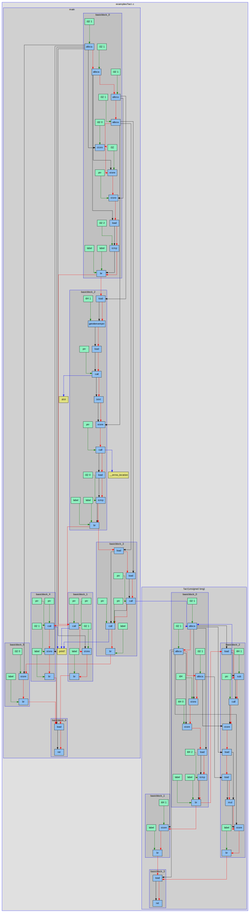
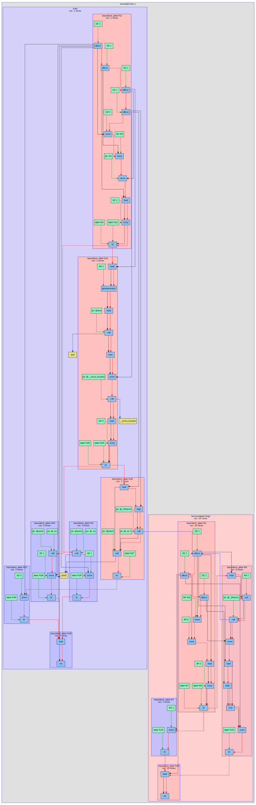
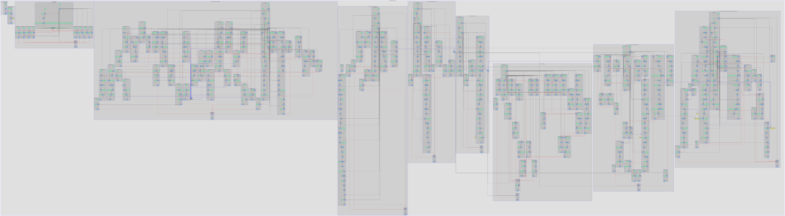
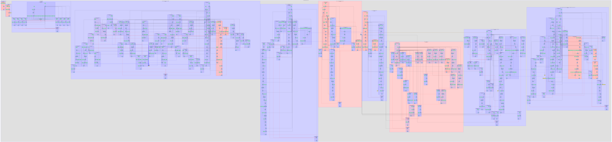

# LLVM Pass

## Цель задачи

Цель задачи заключалась в том, чтобы написать **пасс-плагин** в **LLVM**, который бы строил **Control Flow Graph** и **Data Flow Graph** для инструкций, а так же граф переходов между базовыми блоками и вызовами функций. Также плагин должен инструментировать **LLVM IR**, добавив вызовы функций, логирующих входы в тела функций и базовых блоков.

После сбора профиля программы, полученного с помощью этих инструкций, надо построить граф с учётом статической и динамической информации.

## Реализованный граф

### Описание графа

В реализованном графе строятся **CFG** и **DFG** для инструкций внутри одного модуля. Инструкции поделены подграфами на базовые блоки, эти блоки поделены подграфами на функции, а их объединяет один общий подграф.

Синими нодами представлены инструкции, а зелёными - параметры инструкций. На графе **красными стрелками** показан **CFG** внутри одной функции, а **вызовы функций** отображены **синими стрелками**. Функции, которые **не имеют тела внутри данного модуля** представлены в виде **жёлтых нод**. **Чёрными** же стрелками показан **DFG**.

### Примеры графа

#### Граф для программы из файла [fact.c](examples/fact.c)

Во-первых я проверил свой граф на примере из репозитория [llvm_course](https://github.com/lisitsynSA/llvm_course/tree/main). Граф без динамического профиля можно посмотреть в файле [fact.svg](data/fact.svg), а с ним - в [fact_10.svg](data/fact_10.svg)

<details>
<summary> Содержимое программы fact.c из папки examples </summary>

``` C++
#include <errno.h>
#include <stdint.h>
#include <stdio.h>
#include <stdlib.h>

uint64_t fact(uint64_t arg) {
  uint64_t res = 0;
  if (arg < 2) {
    res = 1;
  } else {
    uint64_t next = fact(arg - 1);
    res = arg * next;
  }
  return res;
}

int main(int argc, char **argv) {
  if (argc != 2) {
    printf("Usage: 1 argument - factorial len\n");
    return 1;
  }
  uint64_t arg = atoi(argv[1]);
  if (errno == 0) {
    printf("Fact(%lu) = %lu\n", arg, fact(arg));
  } else {
    printf("Usage: 1 argument - factorial len\n");
    return 1;
  }
  return 0;
}
```

</details>

<details>
<summary> Граф программы без учёта динамического профиля </summary>

<div style="width: 100%; height: 800px; overflow: auto; border: 3px solid #707070;">
  
</div>

</details>

<details>
<summary> Граф программы с учётом динамического профиля (производился запуск для вычисления факториала 10) </summary>

<div style="width: 100%; height: 800px; overflow: auto; border: 3px solid #707070;">
  
</div>

</details>

#### Граф для программы из файла [stack.cpp](examples/Stack/stack.cpp)

Так же в качестве примера графа относительно большого модуля можно привести граф, построенный для файла из моего репозитория [Stack](https://github.com/Dinichthys/Stack). Содержимое файла можно посмотреть в файле [stack.cpp](examples/Stack/stack.cpp). Граф без динамического профиля же можно посмотреть в файле [stack.svg](data/stack.svg), а с ним - в [stack_100.svg](data/stack_100.svg).

<details>
<summary> Граф программы без учёта динамического профиля </summary>

<div style="width: 100%; height: 800px; overflow: auto; border: 3px solid #707070;">
  
</div>

</details>

<details>
<summary> Граф программы с учётом динамического профиля (производился запуск для создания стека и добавления в него 100 элементов) </summary>

<div style="width: 100%; height: 800px; overflow: auto; border: 3px solid #707070;">
  
</div>

</details>

## Build

Для сборки проекта запустите следующий скрипт

``` bash
cmake -S . -B build
cmake --build build
```

## Usage

Если Ваша программа состоит из одного файла, тогда для использования плагина запустить следующий скрипт

``` bash
sh scripts/run.sh ваш_файл_для_анализа.cpp
```

Иначе воспользуйтесь данным скриптом, чтобы получить объектный файл, который затем сможете слинковать с Вашим проектом

``` bash
sh scripts/build_target.sh ваш_файл_для_анализа.cpp
```

На выходе получится объектный файл `res.o`, который будет находиться в папке `log`. После сборки Вашего проекта и запуска его, проследуйте следующим действиям

``` bash
./build/build_graph
dot -Tsvg log/tmp.dot -o log/tmp.svg
```

В результате получится граф с учётом динамического профиля `tmp.svg` в папке `log`.
